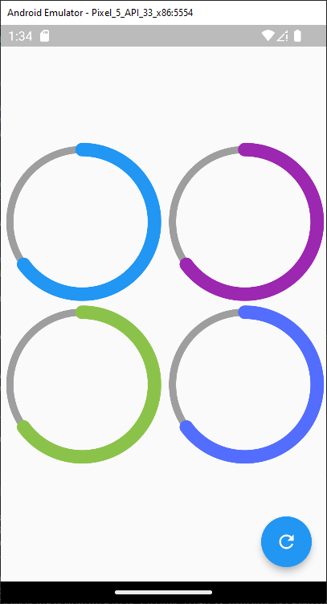
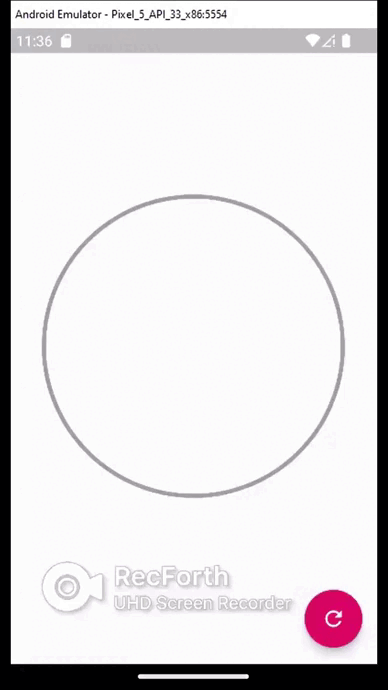
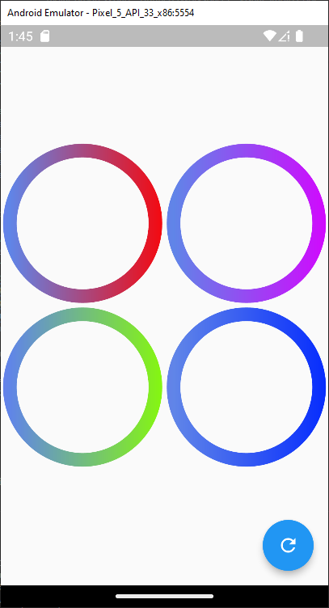

# b_circular_progress 
<!-- https://en.wikipedia.org/wiki/Markdown -->
<!-- https://docs.github.com/en/repositories/managing-your-repositorys-settings-and-features/customizing-your-repository/about-readmes  -->
Disenos de Circular Progress Indicator
## Appearance Application
 

